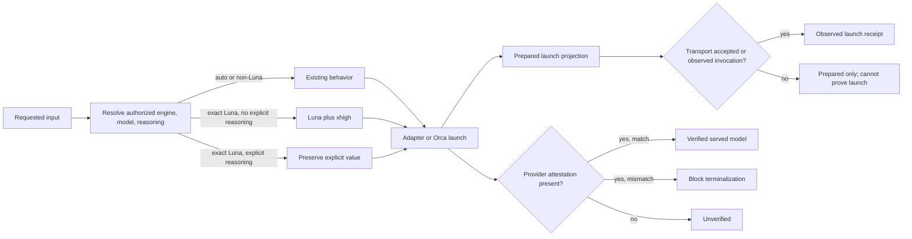
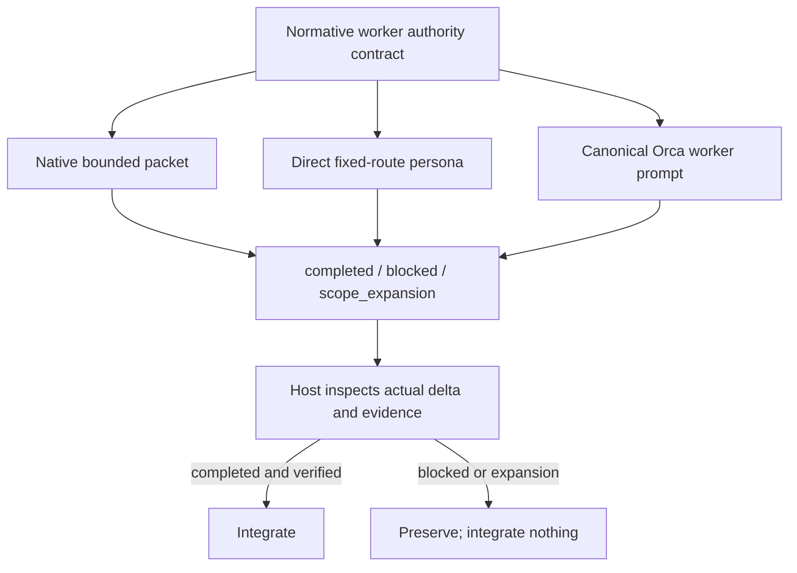

# CE Work Delegated Worker Safety - Plan

## Overview

Improve `ce-work` so inexpensive execution workers remain bounded, useful, and auditable without making Luna the global model. The change aligns the three worker paths—ordinary native delegation, the direct fixed-route adapter, and Orca—around one authority contract; records requested, launched, and provider-attested model identity as distinct facts; and replaces broad ignored-artifact cleanup with prevention, isolated verification, and exact operator-authorized recovery.

The current dirty branch is the in-flight baseline. Existing user changes must be reconciled and preserved, not overwritten or treated as already shipped.

## Problem Statement

The current work established several correct foundations: explicit `runtime:native` can bypass Orca probing, exact direct-route Luna selection can request `xhigh`, non-Luna direct Codex routes remain `high`, and terminalization blocks ignored worker output. The surrounding contract is still incomplete:

- the worker prompt bans implementation choices too broadly, which can make a bounded worker stop on routine local coding decisions;
- the authority boundary is not expressed consistently across native, direct fixed-route, and Orca workers;
- Orca does not preserve `scope_expansion` as a distinct terminal outcome;
- requested model configuration, the command launched by the transport, and the model attested by the provider can be conflated;
- host verification currently infers ownership from timing and may restore or remove ignored paths it does not own;
- Luna-specific effort must remain selective and must not become a global default through configuration drift.

## Goals

- Make Luna a fast bounded worker only when explicitly selected by the caller or an enabled configuration policy.
- Let every implementation worker decide routine local details that are already constrained by the unit and repository patterns.
- Stop and escalate decisions that change observable contracts, authority, or material tradeoffs.
- Preserve an honest evidence chain from selection through launch to provider attestation.
- Keep terminalization fail-closed while offering a safe, exact recovery path for disposable worker and verification outputs.
- Preserve behavior across native, direct fixed-route, and Orca execution, including resume and generated-bundle parity.

## Non-Goals

- Making Luna the default model for `ce-work`, Codex, Orca, or any global profile.
- Letting Luna design units, resolve product ambiguity, expand scope, or choose policy and architecture.
- Proving model identity from prompt text, requested configuration, command arguments, or the worker's own statement.
- Automatically deleting, restoring, or relocating arbitrary ignored content.
- Weakening terminalization, path allowlists, host verification, canonical commit ownership, or all-or-none batch integration.
- Redesigning the general model-selection policy beyond the exact Luna effort rule.

## Requirements

### R1 — Selective Luna routing

`ce-work` MUST preserve its normal engine and model resolution. Only the canonical, case-sensitive identifier `gpt-5.6-luna` receives automatic `xhigh` when it wins through explicit per-run intent or enabled configuration and reasoning was not explicitly set. Near-miss, aliased, or version-suffixed identifiers retain normal resolution and are reported without Luna normalization. `auto`, native execution, built-in Orca defaults, and explicit non-Luna models MUST retain their existing behavior. An explicit reasoning value MUST win over the Luna-derived default. When the resolved target requires Luna or `xhigh` and the frozen transport capability snapshot does not advertise it, resolution MUST fail before dispatch without changing unrelated routes.

### R2 — Shared worker authority boundary

All three worker paths MUST use the same behavioral partition:

- the worker MAY choose local naming, helper extraction, control flow, test arrangement, and implementation mechanisms when the unit's observable contract and nearby repository patterns constrain the result;
- the worker MUST return `blocked` when an unresolved choice affects observable behavior, public API/schema/data, persistence semantics, architecture, scope intent, policy, security, compatibility, thresholds, or a material cost/latency/quality tradeoff;
- the worker MUST return `scope_expansion` only when correct execution requires undeclared paths, permissions, recipients, tools, or broader unit authority;
- tool/runtime failure that does not require more authority remains `blocked`.

This boundary is prompt-enforced and behaviorally evaluated, not a runtime security proof. A completed worker MUST report the local choices it made and the unit constraint or repository pattern that justified each one; the host reviews this decision log alongside the actual delta and remains authoritative.

### R3 — Structured terminal outcomes

Native packets, direct fixed-route results, and Orca results MUST preserve the meanings of `completed`, `blocked`, and `scope_expansion`. A blocker identifies the smallest missing decision or recovery need. An expansion identifies exact requested paths or authority and a reason. Expansion requests are untrusted input and MUST be validated against a run-level outer envelope. Paths outside the repository/workspace, credential or key locations, new recipients, and new network/tool authority cannot be approved in-run; they require a separate out-of-band operator grant. The approval record stores only the exact authority actually granted. Non-complete units MUST integrate no changes, and Orca batches MUST remain all-or-none.

### R4 — Deterministic runtime override

An exact current-prompt `runtime:native` MUST resolve native before any Orca health probe and MUST not silently fall back through a different route. `auto` and explicit `orca` retain their existing attestation and fail-closed semantics.

### R5 — Three-layer execution evidence

Receipts MUST keep these facts separate:

1. requested configuration, resolved authorized target, precedence source, and frozen transport capability snapshot;
2. transport-owned evidence that distinguishes a prepared launch projection from an invocation accepted or observed by the transport, bound to run, unit, attempt/job, and packet digest;
3. provider-attested served-model identity and verification status.

Missing provider evidence MUST remain `unverified`. Transport launch is compared with the resolved authorization, not raw `auto` input. A prepared-only receipt cannot prove launch. A mismatch MUST block terminalization. Historical receipts without new optional evidence MUST remain readable and MUST NOT be upgraded by inference.

Launch receipts MUST use an explicit semantic allowlist—engine, model, reasoning/effort, transport, run/unit/attempt/job identities, capability/contract epoch, and packet/authorization digests. Credentials, environment values, tokens, and credential-bearing endpoint arguments MUST NOT be persisted; sensitive comparison inputs use a non-reversible keyed digest when comparison is necessary. When the frozen capability snapshot promises launch observation, a prepared-only receipt blocks terminalization. When the transport does not support launch observation, the receipt records `launch_unattested` and does not claim launch proof. Provider identity MUST come only from structured provider/transport-owned metadata that model-authored output cannot forge; attestation-shaped worker text is ignored.

### R6 — Strict ignored-artifact prevention and recovery

Terminalization MUST continue to reject any ignored worker output. Worker commands MUST disable disposable output or redirect it outside the worker workspace into controller-owned scratch; host verification runs only in the disposable sandbox required by R7. There is no automatic quarantine path. Every ignored object discovered in the worker workspace is preserved and blocks. A later exact host/operator recovery action MAY authorize moving the observed object after stable identity/digest inspection, but that authority proves permission, not worker ownership. The grant must originate outside worker-authored output and worker-writable files, and its receipt records actor, channel, timestamp, exact granted path, and observed identity. Bounded recovery inspection reuses the existing defaults of at most 512 entries and 64 MiB total and adds a maximum directory depth of 32; exceeding any bound preserves and blocks. Unknown, racing, aliased, oversized, or unsafe state MUST be preserved and MUST block.

### R7 — Non-destructive host verification

Host verification MUST run in a controller-created disposable verification worktree/sandbox and MUST NOT infer ownership from a path appearing during a command. It may reuse an explicitly selected interpreter/toolchain from the canonical checkout, but it MUST NOT reuse writable ignored state from that checkout or the worker workspace. If isolated verification cannot be established, the run preserves state and blocks. It MUST NOT automatically restore modified/deleted pre-existing ignored files or remove unknown new ignored paths. Tracked/index reconciliation remains independent and exact. Verification succeeds only when the tracked state is reconciled and every ignored-state observation has an authorized disposition.

### R8 — Crash-safe and backward-compatible recovery

Each new attempt freezes a contract epoch and transport capability snapshot. Explicit post-block recovery writes an attempt-scoped, append-only authorization receipt before movement, revalidates the source identity under the existing integration lock, then performs one same-filesystem atomic rename into an owner-only recovery location. Resume reconciles only the receipt and the two exact identities; it never copies, deletes a replacement, restores content automatically, or infers authority from timing. Legacy unfinished verification has no recovery authority; completed historical runs remain observation-only; unknown future epochs fail closed. An explicit operator-authorized abandon action MAY append a terminal receipt, release the current integration lock, and leave every preserved or recovered object untouched. Unattended execution reports the block and stops; it never self-authorizes recovery or abandonment.

### R9 — Canonical Orca ownership and parity

Orca changes MUST be made in canonical `integrations/orca/` sources before generated skill bundles. Source-to-bundle checks, native/Orca semantic parity, and current-source behavioral evaluations MUST prevent drift.

## Acceptance Examples

### AE1 — Auto does not force Luna

Given no explicit model binding and no configured policy selecting Luna, when `ce-work` resolves an implementation route, then it retains the existing auto/native/Orca selection and does not inject Luna or `xhigh`.

### AE2 — Explicit Luna gets bounded xhigh

Given a fixed Codex route explicitly selecting `gpt-5.6-luna` with no reasoning override, when the adapter launches the worker, then the launch evidence records Luna plus `xhigh`; provider identity remains `unverified` unless the provider attests it.

### AE3 — Explicit non-Luna stays unchanged

Given an explicit `gpt-5.6-sol` direct route, when the worker launches, then the adapter records Sol with the existing `high` effort and no Luna-specific behavior.

### AE4 — Explicit Luna reasoning wins

Given exact Luna plus an explicit supported reasoning value, when the target is normalized, then that value is preserved rather than replaced with `xhigh`.

### AE5 — Routine local choice completes

Given a decided unit whose nearby code establishes an existing helper/test pattern, when the worker chooses the conforming local implementation, then it completes and reports evidence rather than blocking on an “implementation mechanism.”

### AE6 — Product or architecture decision blocks

Given a unit that omits a required threshold, compatibility rule, public data shape, or architecture boundary, when the worker reaches that choice, then it integrates nothing and returns `blocked` with the smallest missing decision.

### AE7 — Authority expansion is distinct

Given correct execution requires a path outside the unit allowlist or a new external permission, when the worker detects the need, then it integrates nothing and returns `scope_expansion` with exact requested authority and reason.

### AE8 — Explicit native bypasses Orca

Given an attested Orca terminal and exact current-prompt `runtime:native`, when resolution runs, then native is selected and the Orca probe is never called.

### AE9 — Known disposable output never enters the worker workspace

Given a worker or verification command with known cache/log output, when the controller prepares execution, then it disables that output or redirects it to controller-owned scratch or the disposable verification sandbox; the worker workspace remains free of ignored output.

### AE10 — Unknown ignored state is preserved

Given an undeclared ignored file, symlink, hardlink, unsafe directory, oversized tree, pre-existing file mutation, or race, when verification or terminalization inspects the workspace, then it preserves the observed state, reports the exact blocker, and performs no cleanup or restoration.

### AE11 — Explicit post-failure recovery does not infer ownership

Given terminalization discovers an ignored object, when the host/operator explicitly authorizes recovery of that exact stable identity after the block, then the controller may atomically move it through a separate receipted recovery action; it records permission rather than attribution, and any identity change preserves the object and blocks.

### AE12 — Crash recovery is idempotent

Given a crash immediately before or after an explicitly authorized atomic recovery move, when the run resumes, then the authorization receipt and exact source/destination identities determine whether nothing moved or one complete object moved; ambiguity preserves all observed state and blocks.

## Context & Research

### Repository patterns

- Planning baseline: commit `8274e9c97440417c1941e9af9d17cb5850da93b1`. The in-flight diff treated as existing work is limited to `integrations/orca/references/execution-routing.md`, `skills/ce-work/references/agents/implementation-worker.md`, `skills/ce-work/scripts/cross-model-work.sh`, `tests/orca-config-resolution.test.ts`, and `tests/skills/ce-work-cross-model-routes.test.ts`. U1 begins by comparing those paths with this recorded baseline and blocks if overlapping intent cannot be reconciled safely.

- `skills/ce-work/scripts/cross-model-work.sh` is the direct adapter boundary. The current in-flight change already applies `xhigh` only to exact Luna and leaves auto/non-Luna at `high`.
- `skills/ce-work/SKILL.md` owns ordinary native dispatch; the fixed-route persona is not automatically injected there.
- `skills/ce-work/references/agents/implementation-worker.md` owns direct fixed-route worker instructions.
- `integrations/orca/workflows/work.mjs` owns the canonical Orca worker prompt and result assembly; generated `skills/ce-work/scripts/orca-workflow.mjs` follows from bundle generation.
- `skills/ce-work/scripts/unit_workspace_jobs.py` owns durable job authorization and receipts; `unit_workspace_state.py` owns persisted run/attempt state.
- `skills/ce-work/scripts/unit_workspace_transaction.py` and `unit_workspace_ignored.py` own host verification and ignored-path inspection.
- `unit_workspace_lifecycle.py` already provides fail-closed resume/adoption behavior that this work must preserve.

### Prior learnings

- `docs/solutions/skill-design/requested-vs-verified-model-identity.md` requires requested and verified model identity to remain distinct.
- `docs/solutions/skill-design/paired-old-vs-new-injection-skill-evals.md` and `validate-skill-prose-behavior-with-cross-host-evals.md` require behavioral evaluation, not prose assertions alone.
- `docs/solutions/skill-design/fake-cli-harness-for-skill-judgment-evals.md` provides the deterministic evaluation pattern.
- `docs/solutions/safety/preserve-user-content-across-all-destructive-paths.md` establishes preservation-first destructive-path handling.

### Review findings incorporated

- Fable found no implementation-owned P0–P3 issue in the deterministic native fence and current Luna/non-Luna direct-route tests.
- Fable identified the over-broad worker sentence as a P2 because every implementation requires some local mechanism choice.
- Two Orca research passes independently found the same three worker seams, receipt split, Luna opt-in requirement, and temporal-ownership flaw in host verification.

## Key Technical Decisions

### KTD1 — Luna is opt-in, not a global default

**Decision:** Preserve normal route resolution and derive `xhigh` only for exact Luna selected by explicit intent or enabled configuration when reasoning is omitted. `(session-settled: user-directed — chosen over forcing Luna or xhigh globally: Luna is a bounded worker option, not the universal execution policy.)`

**Rationale:** This matches the user's intended worker tier without changing unrelated workloads, non-Luna cost/latency, or native execution. A global default would make a local optimization an architecture-wide policy.

**Rejected:** Set Luna or `xhigh` in global Codex/Orca defaults; infer Luna from natural-language worker wording.

### KTD2 — Workers own bounded local mechanics

**Decision:** Permit pattern-conforming local implementation choices; reserve observable/public/architectural/policy/security/compatibility/threshold/tradeoff decisions for the host. `(session-settled: user-approved — chosen over banning every technical choice: a worker must still select routine local mechanics to execute a decided unit.)`

**Rationale:** A worker that cannot select a helper, control structure, or internal representation cannot execute a fully decided unit. The observable-contract boundary keeps it useful without granting product or architecture authority.

**Rejected:** Ban all technical or implementation decisions; let workers resolve any ambiguity within allowed paths.

### KTD3 — One semantic contract, three transport-specific injections

**Decision:** Add one authoritative worker authority/outcome contract under `skills/ce-work/references/`, plus a shared conformance-case corpus. Treat native packet text, direct persona, Orca prompt, and transport schemas as projections of that contract rather than assuming one persona reaches every worker.

**Rationale:** Native, direct, and Orca paths have separate prompt construction and result schemas. Shared semantics with path-specific adapters avoid both drift and false coupling.

### KTD4 — Requested, resolved, launched, and served are separate stages

**Decision:** Keep three user-facing truth layers while recording the full chain `requested input → resolved authorization → prepared/observed transport launch → provider attestation`. Add transport-owned launch evidence without repurposing existing requested or provider fields. Provider absence stays unverified.

**Rationale:** Configuration proves intent, argv/config proves transport action, and provider events prove served identity. Conflating them creates false attestation.

**Rejected:** Treat the requested model, adapter-selected route, command argv alone, or worker self-report as provider proof.

**Evidence boundary:** Persist only the allowlisted semantic projection. Provider verification accepts only structured metadata from a channel the served model cannot author.

### KTD5 — Prevention and isolation replace automatic cleanup

**Decision:** Disable or redirect known disposable worker outputs, run host verification in a disposable sandbox, preserve and block on every unexpected worker-workspace artifact, and offer only a separate post-block operator-authorized recovery action for an exact stable object. `(session-settled: user-approved — chosen over automatic quarantine: prevention and explicit recovery provide the safety outcome with much less state-machine complexity.)`

**Rationale:** “Appeared during verification” cannot distinguish command output from concurrent user/process state. Prevention plus whole-sandbox disposal handles the common case without building an automatic custody state machine; explicit operator authority handles the exceptional case.

**Rejected:** Automatic quarantine, broad cache allowlists, glob cleanup, worker self-declared ownership after creation, automatic restoration of pre-existing ignored files, or deletion based only on before/after observation.

### KTD6 — Explicit recovery is one atomic, recoverable move

**Decision:** After an out-of-band operator grant, move the exact revalidated object to a distinct owner-only, attempt-specific recovery location on the same filesystem. If atomic rename cannot be guaranteed, preserve and block; do not fall back to copy-plus-delete. Resume may reconcile the move but never initiates recovery or restores content automatically.

**Rationale:** Durable identity/digest receipts make recovery idempotent and keep data recoverable. The destination must be physically excluded from worker and verification authority.

### KTD7 — Compatibility is consumer-first and epoch-bound

**Decision:** Freeze an immutable attempt-level contract epoch/capability snapshot. Update readers and persistence for old/new shapes before any producer emits new statuses or receipts. Prefer additive records when consumers accept them; otherwise revise the protocol. Legacy absence follows legacy rules, malformed current or unknown future epochs fail closed, and historical generic failures are never reclassified.

**Rationale:** Completed historical runs must remain readable, while newly created attempts can be held to the stronger contract.

### KTD8 — Canonical Orca sources lead generation

**Decision:** Edit canonical integration sources first and regenerate all skill-local copies.

**Rationale:** This is the repository's established ownership direction and is mechanically enforceable with bundle checks.

## High-Level Technical Design

These sketches define responsibilities and evidence flow, not implementation signatures.

### Model selection and attestation



### Shared semantics across worker seams



### Ignored-artifact prevention and explicit recovery

```mermaid
stateDiagram-v2
  [*] --> Prevent: disable or redirect known disposable output
  Prevent --> Running: worker runs; verification uses disposable sandbox
  Running --> Success: worker workspace has no ignored output
  Running --> PreserveBlock: any ignored output is preserved and blocks
  PreserveBlock --> HostRecovery: operator authorizes exact stable object out of band
  HostRecovery --> Inspect: permission recorded; ownership not inferred
  Inspect --> PreserveBlock: bounds or identity check fails
  Inspect --> Renamed: atomic same-filesystem move
  Renamed --> Reconcile: append recovery receipt and recheck workspace
  Reconcile --> Success: no remaining blockers
  PreserveBlock --> [*]
  Success --> [*]
```



## Implementation Units

### U1 — Finalize selective routing and reasoning resolution

**Requirements:** R1, R4, R9; AE1–AE4, AE8.

**Files:**

- `skills/ce-work/scripts/cross-model-work.sh`
- `integrations/orca/runtime-bundle.mjs`
- `integrations/orca/defaults.yaml` only if fixture/schema support requires it, never to change the default target
- `integrations/orca/references/execution-routing.md`
- generated `skills/*/references/orca-routing.md` and runtime bundles
- `tests/skills/ce-work-cross-model-routes.test.ts`
- `tests/orca-config-resolution.test.ts`
- `tests/orca-doc-contracts.test.ts`

**Approach:** Reconcile the in-flight exact-Luna branch rather than replacing it. Normalize Luna effort only at the resolver/adapter boundary that owns model and reasoning selection, after precedence identifies the winning layer, and only when reasoning is omitted. Native records unsupported/unverified effort rather than accepting CE injection. Orca either passes its own resolved target to a capable endpoint or retains its configured model/effort unchanged. Keep current-prompt `runtime:native` as structured resolver data evaluated before health probing. Add fixtures narrowly so built-in targets stay unchanged.

**Test scenarios:**

- auto route launches without an explicit model and retains direct Codex `high`;
- exact Luna from prompt, project config, and named profile derives `xhigh` when reasoning is omitted;
- exact Luna with explicit supported reasoning preserves it;
- explicit Sol remains `high`;
- endpoint missing Luna or `xhigh` capability fails before dispatch;
- exact current-prompt native invokes no Orca probe, while auto and explicit Orca keep their existing paths.
- native plus a Luna indication still selects native with no probe, direct adapter, or CE model injection;
- an Orca-selected model is not rewritten by the direct-adapter Luna rule.

**Verification outcome:** The resolved target and launched command prove Luna is selective; no global defaults or unrelated tiers change.

### U2 — Propagate the worker authority and terminal contract

**Requirements:** R2, R3, R9; AE5–AE7.

**Files:**

- `skills/ce-work/SKILL.md`
- `skills/ce-work/references/worker-authority-contract.md` (new authoritative semantic contract)
- `skills/ce-work/references/agents/implementation-worker.md`
- `skills/ce-work/references/implementation-result-schema.json`
- `integrations/orca/workflows/work.mjs`
- `integrations/orca/contracts/work-result.schema.json`
- generated `skills/ce-work/scripts/orca-workflow.mjs` and bundled contracts
- `tests/skills/ce-work-outcome-spine.test.ts`
- `tests/skills/ce-work-cross-model-integration.test.ts`
- `tests/orca-work.test.ts`
- `tests/orca-native-parity.test.ts`
- a shared conformance-case corpus fixture under the existing `tests/skills/` fixture convention

**Approach:** First name the authoritative contract and conformance corpus, then inspect schema openness, readers, persisted-run consumers, and installed bundle expectations. Choose additive extension or protocol revision before changing producers; sequence `reader accepts old/new → persistence accepts old/new → producer emits new → generated bundles update`. Replace the blanket prohibition at its owning sentence. Express the same falsifiable boundary in ordinary native dispatch, direct persona, and canonical Orca prompt. Extend Orca's unit result to preserve scope expansion separately, including exact paths/authority and reason, while retaining zero integration for any non-complete batch. Inability to prove old/new consumer compatibility blocks new-shape emission.

**Test scenarios:**

- a nearby pattern determines a private helper or test arrangement and the worker completes;
- an omitted public threshold/policy/data contract returns `blocked` with the missing decision;
- an undeclared path or permission returns `scope_expansion` with exact requested authority;
- malformed or tool-failure output cannot masquerade as expansion;
- one blocked or expanded Orca unit integrates zero changes from its batch;
- all three paths preserve equivalent terminal meaning and evidence.
- a shared normative matrix covers routine local choice, observable decision, authority expansion, and runtime failure;
- captured final native packets, concatenated direct prompts, and canonical Orca `workerPrompt()` each carry unit context, acceptance criteria, path/authority bounds, terminal taxonomy, and smallest-missing-decision guidance;
- rejecting an expansion leaves the unit terminal with no fallback; approving it creates a fresh attempt, packet digest, allowlist/authorization, and receipt rather than promoting the old result.
- an expansion outside the run-level outer envelope, into credential locations, or to a new recipient/network/tool cannot be approved in-run;
- completed results expose local choices and their constraining unit rule/pattern for host review.

**Verification outcome:** Contract tests and behavioral fixtures distinguish worker-owned mechanics, host-owned decisions, and authority expansion without relying only on exact prose matching.

### U3 — Add launch evidence and honest model identity

**Requirements:** R5, R8, R9; AE2–AE4.

**Files:**

- `skills/ce-work/scripts/cross-model-work.sh`
- `skills/ce-work/scripts/unit_workspace_jobs.py`
- `skills/ce-work/scripts/unit_workspace_state.py`
- `skills/ce-work/references/cross-model-execution.md`
- `skills/ce-work/references/implementation-result-schema.json`
- canonical Orca execution/result contracts where the engine exposes launch evidence
- generated skill bundles for any changed canonical Orca contract
- `tests/skills/ce-work-cross-model-routes.test.ts`
- `tests/skills/ce-work-cross-model-integration.test.ts`
- `tests/orca-work.test.ts`

**Approach:** Add backward-compatible readers and the immutable attempt epoch/capability snapshot before new producers. Persist a safe prepared launch projection/digest from controller-validated runner metadata before spawn, then append `launched` only after the transport accepts or observes invocation. Bind both phases to run/unit/attempt/job and packet digest. Compare launch with resolved authorization, not raw request. Surface requested/resolved config, launch phase, and provider attestation separately. For Orca and ordinary native execution, expose only facts their transport can attest; otherwise report provider identity as unverified. New fields are optional for legacy reads but mandatory according to the frozen current epoch.

**Test scenarios:**

- request Luna/xhigh, launch Luna/xhigh, provider attests Luna: all three layers agree;
- resolved authorization differs from observed transport launch: dispatch/terminalization blocks before success;
- request and launch agree but provider receipt is absent: served model remains unverified;
- provider reports another model: mismatch blocks;
- failure before spawn, spawn rejection, and crash between prepared and launched never upgrade prepared evidence to launched;
- a transport that promises launch observation blocks on prepared-only state, while an incapable transport records `launch_unattested` without upgrading it;
- credential-bearing argv/environment values never appear in persisted receipts;
- attestation-shaped worker output cannot change provider verification status;
- resume legacy, current, malformed-current, and unknown-future epoch fixtures without inference or corruption;
- worker-authored argv/model claims cannot replace host transport evidence.

**Verification outcome:** Receipts make each assertion's owner and confidence explicit and survive resume without changing historical meaning.

### U4 — Replace temporal cleanup with prevention and explicit recovery

**Requirements:** R6–R8; AE9–AE12.

**Files:**

- `skills/ce-work/scripts/unit_workspace_transaction.py`
- `skills/ce-work/scripts/unit_workspace_ignored.py`
- `skills/ce-work/scripts/unit_workspace_state.py`
- `skills/ce-work/scripts/unit-workspace.py`
- `skills/ce-work/scripts/unit_workspace_lifecycle.py`
- `skills/ce-work/references/cross-model-execution.md`
- `tests/skills/ce-work-unit-workspace.test.ts`

**Approach:** Inventory every ignored path the current temporal cleanup removes. Suppress each output at its command source or redirect it outside the worker workspace; anything that can be neither suppressed nor redirected becomes an explicit operator-facing blocker. Run host verification in a controller-created disposable worktree/sandbox so its disposable outputs cannot mutate the unit workspace; it may reuse an explicitly selected interpreter/toolchain from the canonical checkout without reusing writable ignored state. Remove all automatic ignored-state deletion/restoration. For exceptional recovery, add an explicit host/operator action that records out-of-band authorization, performs bounded no-follow inspection, revalidates device/inode/type/owner/link-count plus manifest digest/counts under the existing integration lock, and atomically renames the exact object into an owner-only same-filesystem recovery location. Resume only reconciles that single move. Replace ambiguous cleaned-path reporting with redirected outputs, preserved blockers, explicit recoveries, pre-existing changes, and tracked-restoration facts. Legacy cleanup instructions remain read-only evidence and grant no recovery authority.

**Test scenarios:**

- known pytest, bytecode, coverage, compiler, build, and log outputs are disabled or redirected before launch;
- host verification runs in a disposable sandbox and discarding that whole controller-owned sandbox never mutates worker/canonical ignored state;
- undeclared new files/directories remain in place and block even when the command exits zero;
- modified or deleted pre-existing ignored content remains as observed and blocks; it is never restored automatically;
- symlink, hardlink, device/socket, unsafe parent, repo/mount escape, protected-root alias, ownership mismatch, oversize, case/Unicode alias, and mixed tree all preserve and block;
- races before launch and during inspection block without mutation;
- `EXDEV`, destination collision, permission failure, concurrent resume, and crashes immediately around the explicit atomic move preserve one complete source or one complete recovered object; ambiguity blocks with all observed state preserved;
- tracked/index rollback still works independently and cannot claim success over unresolved ignored state;
- an artifact discovered at terminalization receives no automatic authority; only an out-of-band operator grant can recover the unchanged exact object, while any replacement preserves and blocks;
- recovered content is never automatically restored over a recreated workspace path;
- real worker and host verification commands complete with zero preserved-unknown blockers after their known disposable outputs are suppressed or redirected;
- operator-authorized attempt abandonment releases the integration lock, preserves all objects, and cannot occur automatically in unattended execution.

**Verification outcome:** No test expects automatic cleanup or quarantine. Common disposable output is prevented or isolated; exceptional movement is operator-authorized, exact, atomic, receipted, and recoverable.

### U5 — Prove cross-host behavior and close generated parity

**Requirements:** R1–R9; AE1–AE12.

**Files:**

- `skills/ce-work/references/cross-model-work-eval.md`
- `skills/ce-work/references/worker-authority-contract.md`
- the shared conformance-case corpus created by U2
- deterministic fake CLI/evaluation fixtures under existing `tests/skills/` conventions
- canonical `integrations/orca/` sources changed by U1–U3
- generated skill bundles
- release and packaging tests that enumerate bundle drift

**Approach:** Add paired old-vs-new behavioral cases using current source, not cached installed copies. Make the harness record absolute provenance or digest for every loaded prompt/workflow and fail if provenance is absent or points to an installed cache. Exercise native, direct Luna, direct non-Luna, and Orca workers with the shared conformance corpus. Include approval/failure, no-probe native, no-provider-receipt, scope expansion, ignored-artifact recovery, and checkpoint/resume paths. Test canonical Orca source and regenerated bundle separately with identical expected outcomes. Regenerate once canonical sources are final and require zero drift.

**Test scenarios:**

- each host permits a routine local choice and blocks the same observable-contract ambiguity;
- direct Luna derives `xhigh` while direct Sol/auto do not;
- native execution reports what it can attest and never claims CE-enforced Luna;
- Orca distinguishes blocker from scope expansion and integrates neither;
- provider absence and mismatch produce unverified/block outcomes consistently;
- model-authored attestation-shaped text is ignored;
- injected generated-file drift fails parity; regeneration restores it;
- legacy completed and unfinished run fixtures follow the compatibility rules.
- a deliberately divergent installed/cache copy is ignored in favor of repository sources;
- crashes around blocker/expansion persistence, approval before redispatch, rejection, and resume cause no old-attempt integration or double dispatch.

**Verification outcome:** Targeted suites, bundle checks, upstream checks, release validation, and the full test suite pass against current sources with no generated drift.

## Sequencing and Dependencies

```text
U1 ─┐
    ├──> U3 ───> U4 ───> U5
U2 ─┘
```

- U1 settles target resolution before receipts encode the launched target.
- U2 settles terminal semantics before U3 and U5 persist/evaluate them.
- U3 owns the immutable attempt contract epoch and transport capability snapshot in persisted state; U4 binds explicit recovery receipts to that record and does not define a competing epoch.
- U4 follows U3 because recovery and legacy-resume rules consume that attempt contract.
- U5 owns final generation and broad validation after canonical sources settle.

## System-Wide Impact

### Entry points and interfaces

- `ce-work` prompt parsing and engine resolution retain current precedence; only exact Luna normalization and exact native override are specialized.
- Native packets gain explicit terminal semantics but no new execution authority.
- Direct adapter authorization/result envelopes gain additive launch evidence.
- Orca's worker/result contract gains scope-expansion semantics and possibly additive launch evidence, subject to endpoint capability.
- Return-to-caller envelopes must expose the same truth layers without claiming unsupported attestation.

### State lifecycle

- Every new attempt freezes a known contract epoch and capability snapshot; readers reject malformed current and unknown future epochs before mutation.
- Verification attempts create disposable sandboxes and redirect known outputs before commands run.
- Completed historical receipts remain observation-only.
- Unfinished legacy attempts have no recovery authority and fail closed on ignored-state differences.
- Explicit recovery has one append-only authorization/result receipt and runs under the existing integration lock.
- The lock remains held or recovery remains pending while tracked restoration or ignored-state disposition is unresolved; stale resumptions cannot move content.

### Failure propagation

- Resolver capability failure stops before dispatch.
- Blocked, scope-expanded, malformed, mismatched-model, or unsafe-artifact units integrate nothing.
- Orca batch integration stays all-or-none.
- Unknown ignored state can turn a zero-exit verification command into a blocked verification result.
- No sibling retry or fallback starts while restoration or explicit recovery is unresolved.
- Rejected expansions remain terminal; approved expansions always create a fresh attempt and never promote an old result.

### Security and data integrity

- Prompt text cannot elevate model/effort outside structured resolution.
- Worker self-report cannot grant cleanup authority or attest provider identity.
- Recovery inspection forbids link following, unsafe aliases, unsupported types, ownership mismatch, and unbounded trees.
- Exact physical-root exclusion protects repository, workspace, controller state, and the recovery location from aliasing.
- Same-filesystem atomic rename is mandatory for explicit recovery; device, collision, or durability uncertainty preserves the source and blocks.
- Automated resume never initiates recovery, restores recovered content, or rewrites append-only historical evidence.

### Performance and cost

- No workload moves to Luna unless already selected by intent or policy.
- `xhigh` increases work only for exact Luna with omitted reasoning; explicit effort remains the tuning escape hatch.
- Bounded inventory and recovery limits prevent unbounded filesystem walks; copy-plus-delete is forbidden.

## Verification Strategy

### Contract and resolver layer

- Assert structured runtime precedence, Luna normalization, explicit reasoning precedence, capability rejection, and non-Luna stability.
- Assert direct and Orca schemas preserve distinct terminal outcomes and evidence owners.
- Assert legacy/current/future attempt epochs and consumer-first old/new compatibility before any new producer shape is enabled.

### Process and lifecycle layer

- Use fake CLI/provider streams to prove the exact launch projection and provider attestation split.
- Exercise prepare, authorize, run, terminalize, verify, integrate, resume, and crash boundaries.
- Inspect actual Git deltas and ignored inventories rather than trusting worker-reported paths.
- Exercise prevention, isolated verification, explicit recovery before/after the atomic move, and stale-lock rejection; a successful command or tracked rollback cannot release an unresolved artifact blocker.

### Behavioral agent layer

- Run paired prompts through native, direct, and Orca seams.
- Judge observable outcomes: completes a constrained local choice; blocks a missing product/architecture decision; requests exact scope expansion; never claims unavailable model proof.
- Capture the final assembled packet/prompt at each seam and run the same conformance cases over those real assemblies.

### Repository-wide gates

- Targeted routing, outcome, Orca workflow, parity, and workspace lifecycle suites.
- Canonical bundle generation followed by zero-drift checks and Orca upstream checks.
- Release validation and full test suite after targeted failures are resolved.

## Risks and Mitigations

| Risk | Mitigation | Stop condition |
| --- | --- | --- |
| Luna leaks into defaults or unrelated routes | Exact-model conditional after precedence; negative auto/Sol/profile tests | Any non-Luna resolution or launch changes |
| Worker contract is still too vague or too restrictive | Cross-host behavioral fixtures based on observable choices | A routine local choice blocks or an observable contract choice is guessed |
| Schema change breaks installed Orca endpoints | Additive fields where accepted; explicit protocol revision/capability gate otherwise | Old/new consumer compatibility is not proven |
| Launch receipt is mistaken for provider proof | Separate fields, owners, statuses, and mismatch tests | Served identity can become verified without provider evidence |
| Explicit recovery moves user/concurrent data | Out-of-band operator grant, exact identity recheck, atomic rename, durable receipt, preserve on uncertainty | Any mutation relies only on timing, worker text, or a glob |
| Crash or concurrent resume leaves ambiguous recovery | Same-filesystem atomic rename, append-only authorization/result receipt, existing integration lock | Resume cannot identify one authoritative object safely |
| New producer outruns old readers | Contract epoch and consumer-first rollout | Old/new reader and persistence compatibility is not proven |
| Generated bundles drift | Canonical-first edits and mandatory regeneration/check | Any source/bundle mismatch |
| Dirty user changes are overwritten | Treat current diff as baseline; inspect and patch narrowly | Overlapping edits cannot be reconciled safely |

## Documentation and Operational Notes

- Update `ce-work` execution and routing references so operators know Luna is opt-in, what `xhigh` means, and what remains unverified.
- Document the three evidence layers using explicit ownership language.
- Document artifact prevention, disposable verification, exact host authorization, recovery location/retention, and manual inspection of preserved blockers.
- State explicitly that recovery exists only after an operator grant and never authorizes automatic restoration.
- Include a migration note for unfinished legacy verification attempts: no automatic recovery authority and no legacy auto-clean behavior.
- Define recovery retention operationally; automatic garbage collection is outside this plan unless separately designed with the same receipt-bound safety.
- Keep generated Orca references mechanically synchronized; do not hand-edit cached plugin copies.
- Cache/plugin installation refresh is a deployment step after source validation, not the source of truth and not part of ordinary unit logic.

## Resolved During Planning

- Luna is not forced globally. Exact Luna is selected only by explicit intent or enabled policy.
- Exact Luna with omitted reasoning derives `xhigh`; explicit supported reasoning wins.
- Routine local mechanics belong to the worker; observable/public/architectural/policy decisions do not.
- `blocked` represents unresolved decisions or tool/runtime blockers; `scope_expansion` represents missing authority or paths.
- Missing provider evidence is unverified.
- Unknown ignored state is preserved and blocks, even after a successful command.
- There is no automatic quarantine or cleanup. Explicit recovery requires a new immutable operator-authorization receipt and may move an exact directory root only when every descendant passes bounded no-follow inspection.

## Open Questions

No product-level blocker remains. During U3, implementation must confirm whether the installed Orca endpoint exposes provider-owned served-model attestation. If it does not, the required result is explicitly `unverified`; this is an evidence capability check, not permission to infer identity or redesign the protocol silently.

## Sources & References

- `skills/ce-work/SKILL.md`
- `skills/ce-work/references/execution-engines.md`
- `skills/ce-work/references/cross-model-execution.md`
- `skills/ce-work/references/agents/implementation-worker.md`
- `skills/ce-work/scripts/cross-model-work.sh`
- `skills/ce-work/scripts/unit_workspace_jobs.py`
- `skills/ce-work/scripts/unit_workspace_transaction.py`
- `skills/ce-work/scripts/unit_workspace_ignored.py`
- `integrations/orca/runtime-bundle.mjs`
- `integrations/orca/workflows/work.mjs`
- `integrations/orca/contracts/work-result.schema.json`
- `docs/solutions/skill-design/requested-vs-verified-model-identity.md`
- `docs/solutions/skill-design/paired-old-vs-new-injection-skill-evals.md`
- `docs/solutions/skill-design/validate-skill-prose-behavior-with-cross-host-evals.md`
- `docs/solutions/safety/preserve-user-content-across-all-destructive-paths.md`
